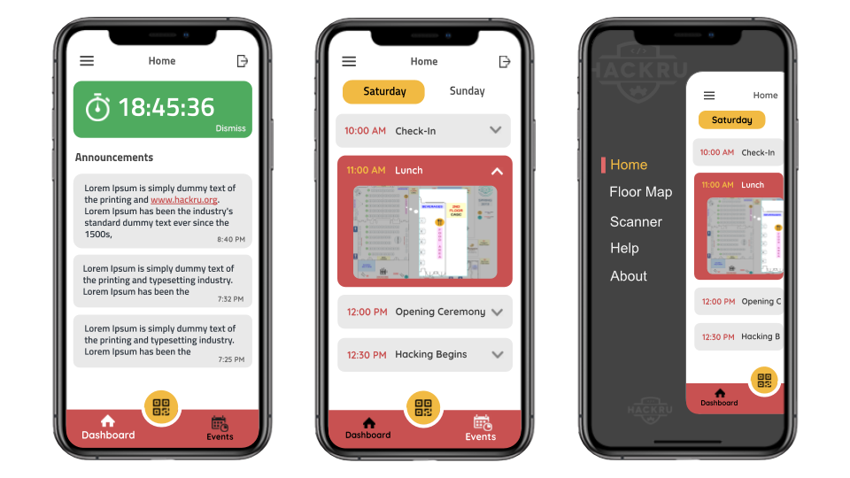
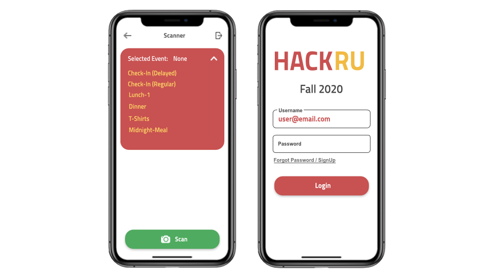

# One App Flutter

The Official HackRU Flutter App

Feel free to show some :heart: and :star: the repo to support the project.


## Description
*What is the purpose of this project?*

A cross-platform mobile application for hackers, organizers, mentors, and sponsors at the HackRU. HackRU is a 24-hour hackathon at Rutgers University. Hackers would be able to get announcements, a QR code for checking, food, t-shirts, as well as see the schedule and map for the hackathon. Organizers & Volunteers would be able to scan hacker's qr code for check-in, food, t-shirts, etc. In backend, we utilize qr scanning data for analytics that can be used after or even during the hackathon. Any more ideas to expand this project are always welcome.




## Inspiration
*How did this project come to be?*

We had started using an inhouse hybrid mobile application to keep track of analytics to get a better idea of how certain aspects of the hackathon were running such as food consumption and optimization for checkin. This project expanded into a public native mobile application so hackers had easier access to their QR code as well as organizers with their scanners. Additional information of the hackathon were incorporated so that everyone would be able to stay up to date on events that are happeneing wherever they may be in the venue.

## Style Guide
Most of the recommended lints directly implement the guidelines set out in [Effective Dart](https://dart.dev/guides/language/effective-dart). In a few cases the lints are stricter than the style guide for the sake of consistency.

<details>
<summary>List of <code>Linter Rules</code></summary>
<p>

```yaml
linter:
  rules:
    - always_declare_return_types
    - always_require_non_null_named_parameters
    - annotate_overrides
    - avoid_empty_else
    - avoid_init_to_null
    - avoid_null_checks_in_equality_operators
    - avoid_relative_lib_imports
    - avoid_return_types_on_setters
    - avoid_shadowing_type_parameters
    - avoid_types_as_parameter_names
    - camel_case_extensions
    - curly_braces_in_flow_control_structures
    - empty_catches
    - empty_constructor_bodies
    - library_names
    - library_prefixes
    - no_duplicate_case_values
    - null_closures
    - omit_local_variable_types
    - prefer_adjacent_string_concatenation
    - prefer_collection_literals
    - prefer_conditional_assignment
    - prefer_contains
    - prefer_equal_for_default_values
    - prefer_final_fields
    - prefer_for_elements_to_map_fromIterable
    - prefer_generic_function_type_aliases
    - prefer_if_null_operators
    - prefer_is_empty
    - prefer_is_not_empty
    - prefer_iterable_whereType
    - prefer_single_quotes
    - prefer_spread_collections
    - recursive_getters
    - slash_for_doc_comments
    - type_init_formals
    - unawaited_futures
    - unnecessary_const
    - unnecessary_new
    - unnecessary_null_in_if_null_operators
    - unnecessary_this
    - unrelated_type_equality_checks
    - use_function_type_syntax_for_parameters
    - use_rethrow_when_possible
    - valid_regexps
```

</p>
</details>

##### Enable `Dartfmt`: (standard Dart formatter)
$ `pub global activate dart_style`

$ `dartfmt <file_name>.dart` (for a specific file)


## Installation Guide
First, install *Flutter* and *Dart* on your machine by following these guidelines: [Get Started](https://flutter.dev/docs/get-started/install)

1. `git clone https://github.com/HackRU/OneAppFlutter.git`
2. `cd OneAppFlutter`  (find OneAppFlutter directory on your machine)
3. `flutter doctor`    (make sure everything is installed correctly)
3. `flutter pub get`   (it's like `npm install`)
4. `flutter run`       (it's like `npm start`)

### Want to Contribute?: [Only Open to Rutgers University Students]
- Creat a new `git branch <name-branch>` + `git commit -am "new updates"` + `git push origin <name-branch>` and then make a pull request.
- Make sure you follow [Style Guides](https://github.com/HackRU/OneAppFlutter#style-guide) as mentioned above
- Contributors should also follow [Git Style Guide](https://github.com/agis/git-style-guide)

To learn about Flutter App Development:

- [Flutter Website: https://flutter.dev](https://flutter.dev/)
- [Libraries: https://pub.dev](https://pub.dev/)
- [Lab: Write your first Flutter app](https://flutter.io/docs/get-started/codelab)
- [Cookbook: Useful Flutter samples](https://flutter.io/docs/cookbook)
- [Official Documentation: (https://flutter.io/docs)], which offers tutorials,
- [Learn Flutter Class: (https://www.appbrewery.co/courses/intro-to-flutter)]
samples, guidance on mobile development, and a full API reference.
- ⭑ (Recommended) Working Examples+Tutorials+Libraries [https://github.com/Solido/awesome-flutter]

### Running Backend Tests (HackRU LCS)
1. also have command line dart installed
2. setup test users and use the test endpoint in hackru-service
3. `export LCS_USER="<username>"` for LCS_USER, LCS_PASSWORD, LCS_USER2, LCS_PASSWORD2
  - lcs user should have the director role
4. `cd lib && dart test.dart`

### For Users
* For Android: Search for `HackRU` app
* For iOS: Search for `HackRU Official` app

### Follow Us On
<a href="https://www.facebook.com/theHackRU/"></a>
<a href="https://www.instagram.com/thehackru/"></a>
<a href="https://hackru.org/"></a>
