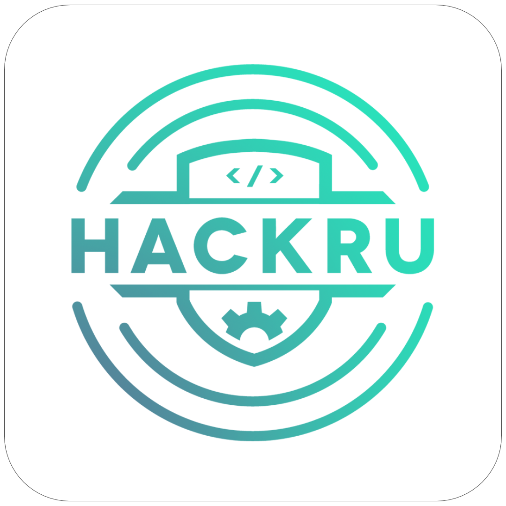

# One App Flutter

The Official HackRU Flutter App

## Description
*What is the purpose of this project?*

This project is a mobile application for hackers, organizers, mentors, sponsors at the hackathon. Hackers would be able to get announcements, get a QR code for checking, food, t-shirts, as well as see the schedule and map for the hackathon. Organizers would be able to scan for checkin, food, t-shirts for analytics that can be used after or even during the hackathon. Any more ideas to expand this project are always welcome.

## Inspiration
*How did this project come to be?*

We had started using an inhouse hybrid mobile application to keep track of analytics to get a better idea of how certain aspects of the hackathon were running such as food consumption and optimization for checkin. This project expanded into a public native mobile application so hackers had easier access to their QR code as well as organizers with their scanners. Additional information of the hackathon were incorporated so that everyone would be able to stay up to date on events that are happeneing wherever they may be in the venue.

## Installation Guide

### For Architects

1. Clone the repository by doing `git clone https://github.com/HackRU/OneAppFlutter.git`
2. Open the folder you created (which is called `OneAppFlutter`) in your desired IDE (Android Studio, Visual Studio Code, Intellij, etc.)
3. Now, run the app by doing `flutter run`

### Want to Contribute?:
- Creat a new `branch` and then make a pull request.

To learn about Flutter App Development:

- [Flutter Website: https://flutter.io]
- [Lab: Write your first Flutter app](https://flutter.io/docs/get-started/codelab)
- [Cookbook: Useful Flutter samples](https://flutter.io/docs/cookbook)
- [Online documentation: (https://flutter.io/docs], which offers tutorials,
samples, guidance on mobile development, and a full API reference.

### For Users

Coming Soon...
Will be available on Play Store and App Store

## Example Uses

List of features goes here...

## Style Guide
#### General
* Contributors should follow our [Git Style Guide](https://github.com/agis/git-style-guide)

#### Resource Files

List of resource files goes here...

## TO-DO List

- To make this app running :)
# DONE
- Basic App Layout, Login/Signup UI, Announcements, Timer, Events, and Floor Map

# NEEDS TO BE DONE
1) Write a String Parser for Announcement Messages from Slack (we need to remove emojies and user mentions)
2) QR Code Scanner UI is working, but need to connect with BackEnd (LCS)
2) QR Code Gen UI is working, but need to connect with BackEnd (LCS)
3) LogIn/SignUp UI is working but need to connect with BackEnd (LCS)
4) "About Page" (which will include Flutter App Dev Team Members, HackRU Rnd Reference, and about the app)
5) "Help/Tool Page" (hoping to add buttons which will redirect to inApp webview for "HelpQ", "HackRU Website", "Team Builder", and whatever hackers need in one click)

## Links to Further docs
TBA

