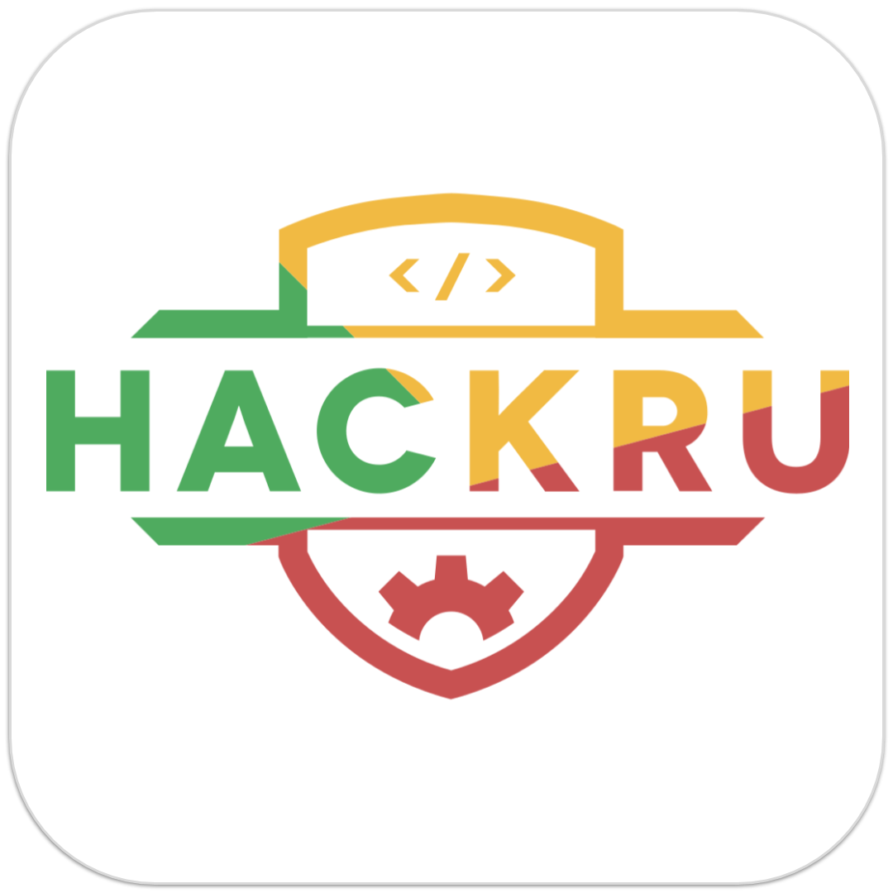

# One App Flutter

The Official HackRU Flutter App

## Description
*What is the purpose of this project?*

This project is a mobile application for hackers, organizers, mentors, sponsors at the hackathon. Hackers would be able to get announcements, get a QR code for checking, food, t-shirts, as well as see the schedule and map for the hackathon. Organizers would be able to scan for checkin, food, t-shirts for analytics that can be used after or even during the hackathon. Any more ideas to expand this project are always welcome.

## Inspiration
*How did this project come to be?*

We had started using an inhouse hybrid mobile application to keep track of analytics to get a better idea of how certain aspects of the hackathon were running such as food consumption and optimization for checkin. This project expanded into a public native mobile application so hackers had easier access to their QR code as well as organizers with their scanners. Additional information of the hackathon were incorporated so that everyone would be able to stay up to date on events that are happeneing wherever they may be in the venue.

## Style Guide
Coming Soon...
We'll be using LINTER for Dart (https://github.com/dart-lang/linter)

## Installation Guide

### For Architects

1. Clone the repository by doing `git clone https://github.com/HackRU/OneAppFlutter.git`
2. Open the folder you created (which is called `OneAppFlutter`) in your desired IDE (Android Studio, Visual Studio Code, Intellij, etc.)
3. Now, run the app by doing `flutter run`

### Want to Contribute?:
- Creat a new `branch` and then make a pull request.
- Contributors should follow our [Git Style Guide](https://github.com/agis/git-style-guide)

To learn about Flutter App Development:

- [Flutter Website: https://flutter.io]
- [Lab: Write your first Flutter app](https://flutter.io/docs/get-started/codelab)
- [Cookbook: Useful Flutter samples](https://flutter.io/docs/cookbook)
- [Online documentation: (https://flutter.io/docs], which offers tutorials,
samples, guidance on mobile development, and a full API reference.

### Running tests
1. also have command line dart installed
2. setup test users and use the test endpoint in hackru-service
3. `export LCS_USER="<username>"` for LCS_USER, LCS_PASSWORD, LCS_USER2, LCS_PASSWORD2
  - lcs user should have the director role
4. `cd lib && dart test.dart`

### For Users

Coming Soon...
Will be available on Play Store and App Store

## Example Uses

List of features goes here...

## To-Do List
### Done
- Basic App Layout, Login/Signup UI, Announcements, Timer, Events, Floor Map, and LCS stuff w/ QRScaner and code gen

### Needs To Be Done
1) "About Page" (which will include Flutter App Dev Team Members, HackRU Rnd Reference, and about the app)
2) scanner ux improvements
- give the users some kinda loading spinner/text
- better auto focus
- hide scan button when selecting event so users know to click save

### would be nice to get done
1) refactoring to make things cleaner

## Links to Further docs
TBA

